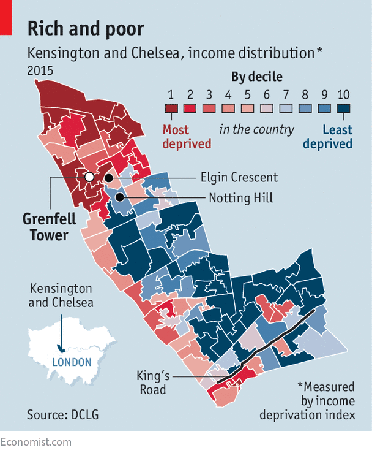

I live in London. More precisely, I live in the Royal Borough of Kensington and Chelsea. Sounds fancy, right? And sure, you can find endless amounts of Russian oligarchs, old English aristocratic families, and newly wealthy European families. Cross a single highway called Westway, however, and you enter one of the poorest neighbourhoods in London.<!--more--> Indeed, this borough has some of the worst inequality in London: 



Such inequality is not foreign to other developed countries such as the United States or neighbouring France, nor is it foreign to my own family. I have had the luck to have had an incredibly privileged and comfortable childhood — however the same can’t be said for my own parents. My father grew up in relative poverty in rural France with his mother alone sustaining him and his sister. My mother spent the first ten years of her life in a tiny apartment in Kiev in what was the Soviet Union with her brother, parents, and grandmothers, and then spent the rest of her childhood in the United States as they immigrated there, arriving with essentially only the clothes on their backs. So, although I have the privilege to have never experienced poverty, it is foreign to neither me nor my family.

Teenagers are some of the worst affected by this inequality. Many grow up in small council flats in crime-stricken neighbourhoods where opportunities are rare and comfort is even rarer. This was rendered even worse with Covid, where during lockdowns teens were forced to stay in said small apartments and expected to do online schooling, even though many didn’t have access to enough computers or a quality internet connection. This resulted in a huge effect on education, with many teens missing months of school, and resulting in a sharp performance decrease in basic subjects such as Maths and English — all while privileged teens (such as myself) attended online school with ease, thanks to better access to technology and more spacious living spaces.

How are we supposed to reduce inequality and spread opportunity, if the wealthy are semesters ahead in education compared to the poor? It seems like the vicious cycle of poverty will worsen and not improve.

That’s why when a good friend of mine told me about this idea he had of creating a student-led charity, where volunteer high school students would tutor fundamental subjects like Maths and English to such underprivileged teens in the my own borough, I was instantly on board — and asked to play a significant role in the creation of the charity itself. 

More than that though, I didn’t want the charity to only help them with the basics — I wanted it to give them more opportunities in life in well-paid industry sectors, so that they can escape poverty much like my parents did. And one of these well-paid jobs that will only grow and expand in the future is software engineering. So, I immediately created a Computer Science course as a supplement to the base Maths, English and French courses, where teens will be taught to code — and not just basic Scratch or Python, but coding that could land them a job in the future, whether that’s after university or right out of high school.

What will the course look like? This was one of the most exciting questions I was confronted with after starting this endeavour. Being the head of the Computer Science department, it was up to me to manage the logistics of the course and create the curriculum.

I didn’t want to specifically teach them web development, or app development, or game development — it’s too specific, and doesn’t leave them with a flexible enough skillset in the future. No, I wanted to teach them a programming language, and teach them deeply. I wanted to teach them a programming language that was similar to as many other languages as possible, so that they can go off exploring other languages and technologies in their free time much like I do. I want to emphasise that I wanted to  give them as many opportunities and as much flexibility as possible. 

That’s why I chose Swift. Not because of my bias towards it (although I definitely do have some), but mostly for technical reasons. First off, it’s a great first language to learn. A core aspect of Swift’s design is “progressive disclosure of complexity”. Chris Lattner, the creator of Swift, says:

> *“The secret to Swift in being easy to learn, easy to use as a teaching vehicle, but also powerful enough to solve the problems that need to be solved, is that the complexity in the language needs to be progressively disclosed.”*

Indeed, it has a really nice linear learning curve — doing simple things is incredibly easy, such as `print("Hello, world")` (a classic very first line of code all programmers learn), which in languages like Java looks more like:

```java
public class HelloWorld {
    public static void main(String[] args) {
        System.out.println("Hello, World!"); 
    }
}
```

What's `public`? What’s `class`? What’s `void`? What’s a `Sytem`? These are all questions beginner programmers shouldn’t have to ask themselves the very first time they write a program. 

Other languages like Python are like Swift also very beginner-friendly. However, while Swift’s learning curve is linear, Python’s learning curve is exponential. Doing easy things is easy, but doing intermediate and expert things becomes exponentially harder, as you are suddenly hit with weird things like `kwargs`, function decoration, and data-classes — all things which aren’t really introduced naturally, but are necessary if you want to do anything moderately complex.

Second, is the fact that Swift resembles many other languages, from C-style languages like C and C++ with it’s use of strong “types” (a concept difficult for non-typed language programmers to grasp) to newer languages like Kotlin and Rust with its modern syntax, to incredibly popular languages like Javascript and Python with its easy of use. This fact was incredibly important for me, as I wanted this course to be a foundation for their many explorations into a whole world of technologies. 

Thanks to these two facts, making a curriculum was very easy. I took great inspiration from Apple’s very own “Develop in Swift” book series (while taking out anything related to iOS development since the teens we’re tutoring don’t have MacBooks), and added in my own sections which I thought were necessary for them to become comfortable with as many concepts as possible. The lessons themselves will be a combination of me explaining and them doing exercises and small quizzes — all while being as informal as possible, since these teens are coming to my lessons on their own time.

And so there you have it. I’ve helped create a charity to tutor young teens in my incredibly unequal neighbourhoods so that they education and opportunities don’t suffer due to Covid. I’m the head of the Computer Science department where I’ll be teaching them to code Swift in a way that presents them with as many opportunities as possible in the future. We are a total of 16 volunteers, and lessons are held twice a week in the North Kensington Library. And what’s the charity called?

[Bridging The Gap](https://www.bridgingthegap.charity/).